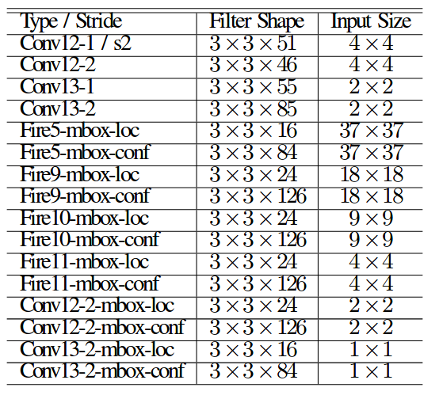
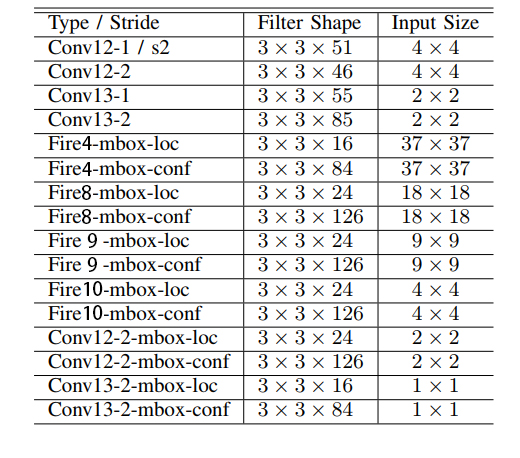
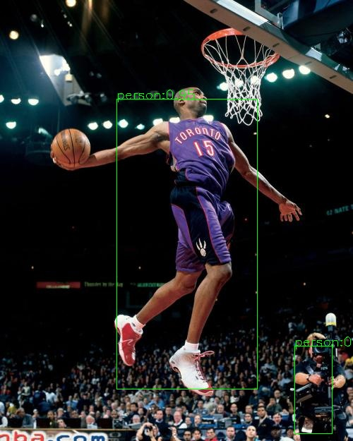

# TinySSD Implementation @ ULSee Inc.
### Prospective
We are looking forward to have a discussion with anyone who are interested in object detection and try to develop better faster algorithms. As the authors claimed, the tiny-ssd could achieve 61.3% on VOC2007, but our released version could only get an accuracy at 59.9%(we re-train and get 61.5%, may be released in future). Therefore, we are releasing our implementation and expect some common researches and discussions. 
### Description  
This is an implementation of the following released paper by ULSee Inc.. It is a simplified structure for SSD(Single Shot MultiBox Detector). 

>@article{DBLP:journals/corr/abs-1802-06488,  
  author    = {Alexander Wong and   
               Mohammad Javad Shafiee and  
               Francis Li and  
               Brendan Chwyl},  
  title     = {Tiny {SSD:} {A} Tiny Single-shot Detection Deep Convolutional Neural  
               Network for Real-time Embedded Object Detection},  
  journal   = {CoRR},  
  volume    = {abs/1802.06488},  
  year      = {2018},  
  url       = {http://arxiv.org/abs/1802.06488},  
  archivePrefix = {arXiv},  
  eprint    = {1802.06488},  
  timestamp = {Thu, 01 Mar 2018 19:20:48 +0100},  
  biburl    = {https://dblp.org/rec/bib/journals/corr/abs-1802-06488},  
  bibsource = {dblp computer science bibliography, https://dblp.org}  
}

**One Revision**
Table II in the paper is not consistent with Table I and Figure 3. It should be revised as:

 => 

In our prototxt, we add every fire module id by 1. The fire1 in paper is our fire2 in protoxt. Therefore, the paper describes fire module from fire1, fire2, fire3 ... to fire10, and our supplied prototxt is from fire2, fire3, fire4 ... to fire11. 

### Usage
 1. Download ssd-caffe and compile the pycaffe
 
 > git clone -b ssd https://github.com/weiliu89/caffe.git 
 2. Download our repository
 
 > git clone https://github.com/lampsonSong/tinySSD.git
 
 3. The hierarchy of tinySSD is:
* **data** 
* **model**
    * *_iter_180000.caffemodel -> *pretrain model (in **our prototxt**, we use fire2 ~ fire9)*
    * *_iter_290000.caffemodel -> *final model*
    * tiny_ssd_voc_train.prototxt -> *train.prototxt, please modify data path*
    * tiny_ssd_voc_test.prototxt -> *test.prototxt, please modify data path*
* **python_script**
    * *generate.py  -> *you can generate deploy.prototxt and train.prototxt using this. Custome the corresponding path including **caffe, your project, your train lmdb*** 
    * *deploy.prototxt -> *our deploy prototxt*
    * *train.prototxt -> *our train prototxt*
* **image**
    * *slam.jpeg -> *test image*
    * *result.jpeg -> *test result*
    * *table0.png -> *table from paper*
    * *table1.jpg -> *table after revison*
* **README.md**
* **solver.prototxt** 
 4. At the tinySSD directory, run
 
> python python_script/generate.py

to get *deploy.txt* and *train.prototxt* under *python_script*

 5. revise the demo.py to check the result
> python demo.py

 => 

